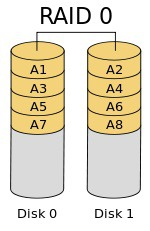
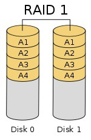
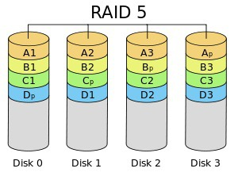
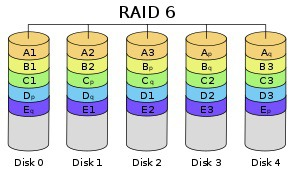

# RAID에 대해서 설명해주세요.

## RAID란 무엇인가?
- Redundant Array of Inexpensive(Independent) Disk (저렴한/독립된 디스크의 복수 배열)<br>
→ RAID는 여러개의 디스크를 묶어 하나의 디스크 처럼 사용하는 기술

## RAID를 사용하는 이유?
- RAID를 사용하면 여러 개의 디스크를 하나의 논리적 볼륨으로 구성할 수 있어, 사용자에게는 마치 단일 큰 저장소처럼 보인다.
이로 인해 데이터 관리가 용이해지고, 대용량 데이터 저장이 가능하다.
- 디스크 I/O 병렬화로 인한 성능 향상이 가능하다 (RAID 0, RAID 5, RAID 6 등 여러 디스크에서 동시에 읽기 쓰기 작업 수행)
- RAID를 구성하는 디스크의 개수가 같아도, RAID의 구성 방식에 따라 성능&용량이 바뀌게 되고, 이 구성 방식을 RAID Level (레이드 레벨) 이라고 부른다.

## RAID Level

### RAID Level을 이해하기 위한 개념들

#### (1) Striping(스트라이핑)
Striping은 RAID에서 데이터를 여러 개의 디스크에 나누어 분산 저장하는 방법이다.
- 작동 방식: 데이터가 디스크에 저장될 때, 큰 데이터 블록이 여러 개의 작은 블록으로 나뉘어 각각의 디스크에 순차적으로 저장된다.
  (반복적으로 데이터 분산 저장)
- 장점: 여러 디스크에서 동시에 읽고 쓸 수 있어 데이터 전송 속도가 증가한다. 대용량 파일을 처리할 때 성능이 크게 향상된다.
- 단점: RAID 0처럼 데이터 중복이 없는 구성에서 하나의 디스크라도 고장이 나면 전체 데이터가 손실된다.
따라서 중복 저장 등을 통해 보완이 필요하다.

#### (2) Parity(패리티)
RAID에서 데이터의 무결성을 보장하고 장애 발생 시 데이터를 복구할 수 있게 만든다.(주로 RAID 5와 RAID 6에서 사용)
- 작동 방식: 패리티는 데이터 블록의 비트 정보의 조합을 통해 생성된다. 
각 디스크에 저장된 데이터의 XOR 연산을 사용하여 패리티 정보를 생성한다.
- 장점: RAID 5에서는 한 개의 디스크가 고장 나더라도 패리티 정보를 사용해 손실된 데이터를 복구할 수 있다.
- 단점: 패리티 정보를 계산하는 과정에서 약간의 성능 저하가 발생할 수 있다. 특히 쓰기 작업 시, 패리티 블록을 업데이터 해야하는 비용이 추가적으로 발생한다.

※ 단점에서 언급하는 내용은 특정한 디스크에 대해서만 몰아서 전체 패리티 비트를 관리하면 그렇게 되는데 RAID 5, 6은 그걸 개선한 것이다.

### RAID 0
- Striping (스트라이핑) 이라고도 부른다.
- RAID를 구성하는 모든 디스크에 데이터를 분할하여 저장한다.
- 전체 디스크를 모두 동시에 사용하기 때문에 성능은 단일 디스크의 성능의 N배가 되고, 용량 역시 단일 디스크 용량의 N배가 된다.
- But, 하나의 디스크라도 문제가 발생 할 경우 전체 RAID가 깨지기 때문에 안정성 측면에서 좋지 않다.
- 성능과 용량은 최대한으로 사용하기 때문에 성능/용량 평가 시 최상단 기준으로 쓰이지만, 안정성이 극악이므로 실제 서버 환경에서는 거의 사용하지 않는다.



### RAID 1
- Mirroring (미러링) 이라고도 부른다.
- RAID 1은 모든 디스크에 데이터를 복제하여 기록한다. 즉, 동일한 데이터를 N개로 복제하여 각 디스크에 저장한다.
- 때문에 여러 개의 디스크로 RAID를 구성해도, 실제 사용 가능한 용량은 단일 디스크의 용량과 동일하다.
- 안정성이 높은 대신, N개 만큼 복제하는 것이 비효율적이기 때문에 비용 문제로 실제 서버 환경에서 잘 사용하지 않는다.
- Write 할 때, 데이터를 복제하여 기록하기 때문에 RAID 컨트롤러가 복제, 연산 하는 시간이 들어 단일 디스크의 Write 성능보다 낮을 수도 있다.
- 하지만 Read 할 때, 전체 디스크에서 읽을 수 있어서 단일 디스크의 N배의 성능이 나온다.



### RAID 5
- 제일 사용 빈도가 높은 RAID Level 이다. (범용적)
- Block 단위로 striping을 하고 error correction을 위해 패리티를 1개의 디스크에 저장한다.
- 이 때, 패리티 저장하는 디스크를 고정하지 않고, 매번 다른 디스크에 저장한다.
- 용량 및 성능이 단일 디스크 대비 (N-1) 배 증가한다.
- RAID 0에서 성능, 용량을 조금 줄이는 대신 안정성을 높인 RAID Level이다.



### RAID 6
- RAID 5에서 성능, 용량을 좀 더 줄이고 안정성을 좀 더 높인 RAID Level 이다.
- Block 단위로 striping을 하고, error correction을 위해 패리티를 2개의 디스크에 저장한다.
- 용량 및 성능이 단일 디스크 대비 (N-2) 배 증가한다.
- 

## Parity를 사용하여 복구하는 원리
XOR(배타적 OR) 연산을 쉽게 보여주기 위해 비트 수준의 예시를 사용했다.

```javascript
두 개의 데이터 블록 A와 B가 있다고 가정하자. 
(각 데이터는 4비트로 구성된 이진수 형태)

- 데이터 A: A = 1101 (= 13)
- 데이터 B: B = 1011 (= 11)

이 두 데이터에 대해 XOR 연산을 수행하자.

A = 1101
B = 1011
-----------
P = A XOR B = 0110

비트별 XOR 연산

1. 첫 번째 비트: 1 XOR 1 = 0
2. 두 번째 비트: 1 XOR 0 = 1
3. 세 번째 비트: 0 XOR 1 = 1
4. 네 번째 비트: 1 XOR 1 = 0

따라서, 패리티 P는 0110이 된다.


다음으로, 데이터 A의 손실을 가정했을 때, A를 복구하기 위해 패리티 P와 B를 사용한다.

A_복구 = P XOR B

P = 0110
B = 1011
-----------
A_복구 = P XOR B = 1101


1. 첫 번째 비트: 0 XOR 1 = 1
2. 두 번째 비트: 1 XOR 0 = 1
3. 세 번째 비트: 1 XOR 1 = 0
4. 네 번째 비트: 0 XOR 1 = 1

따라서, A_복구 = 1101로 원래의 데이터 A를 성공적으로 복구할 수 있다.
```

## 참고자료
https://devocean.sk.com/blog/techBoardDetail.do?ID=163608<br>
https://icksw.tistory.com/182<br>
https://hazel-developer.tistory.com/162